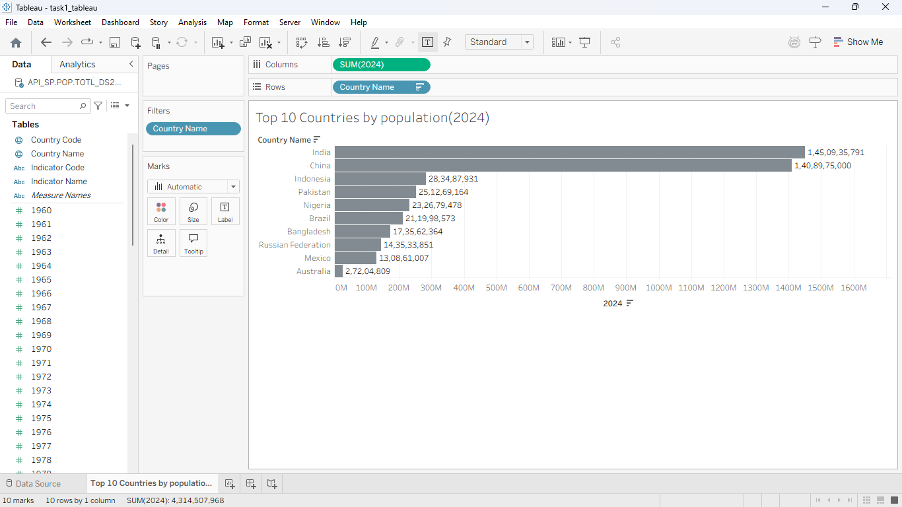

# PRODIGY_DS_01

## Task 01 - Data Visualization

### Objective
Create a bar chart or histogram to visualize the distribution of a variable.

### Tool Used
Tableau

### Dataset
World Bank Population Dataset

### Description
Created a bar chart to visualize the population distribution of the top 10 countries in 2024.

### Output

