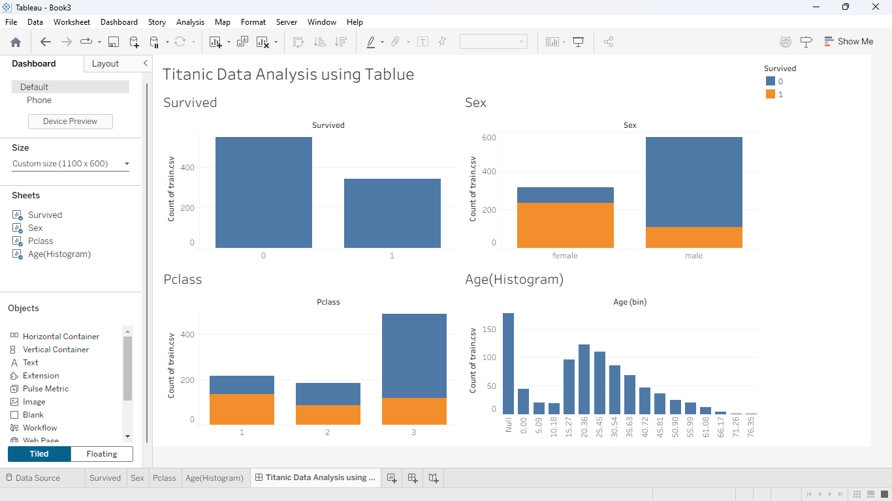

# Task 02 - Data Cleaning & EDA

## 📊 Tool Used
Tableau

## 📂 Dataset
Titanic Dataset (Kaggle)

## 🎯 Objective
Perform data cleaning and exploratory data analysis (EDA).

## 📈 Visualizations
- Survival Count
- Survival by Gender
- Survival by Passenger Class
- Age Distribution (Histogram)

## 🔍 Insights
- Females had higher survival rate
- Majority passengers were in 3rd class
- Most passengers aged between 20–40

## 📸 Output

