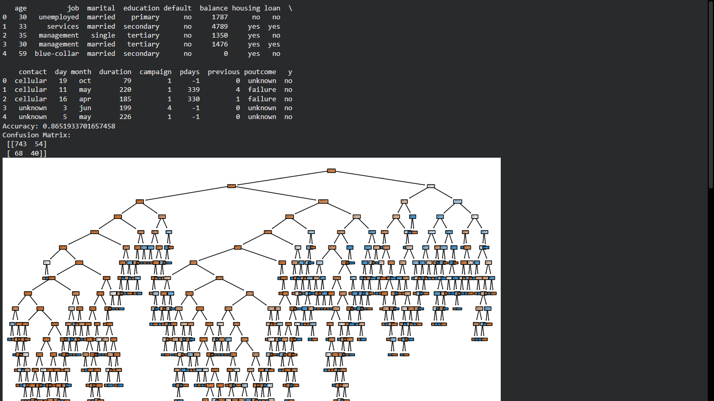
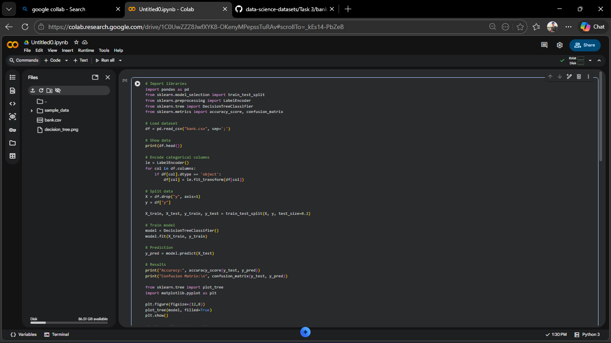

## 📊 Dataset
Bank Marketing Dataset (UCI Repository)

## 🎯 Objective
Build a Decision Tree Classifier to predict whether a customer will purchase a product.

## 🛠️ Tools Used
- Python
- Pandas
- Scikit-learn

## ⚙️ Model
Decision Tree Classifier

## 📈 Results
- Accuracy: ~85%
- Confusion Matrix:
  [[743 54]
   [68 40]]

## 📸 Output

## Code

