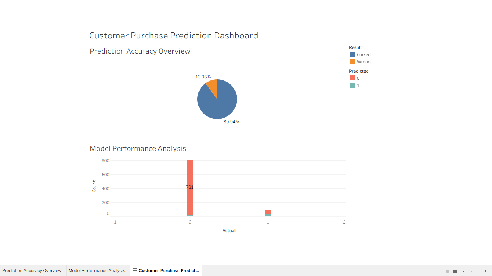

# Task 03 - Decision Tree Classifier

## 📌 Objective
Build a Decision Tree model to predict customer purchase behavior.

## 🧠 Machine Learning
- Algorithm: Decision Tree Classifier
- Accuracy: ~89%

## 📊 Tableau Dashboard
- Prediction Accuracy (Pie Chart)
- Model Performance Analysis (Bar Chart)

## 🛠 Tools Used
- Python
- Pandas
- Scikit-learn
- Tableau

## 📷 Dashboard Preview

